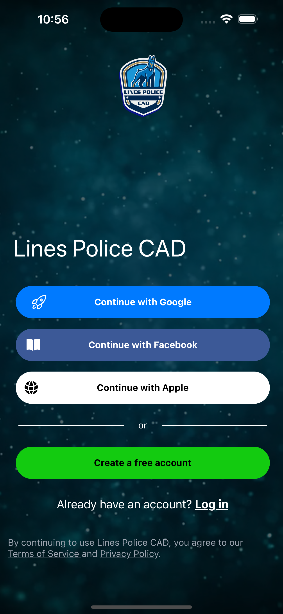
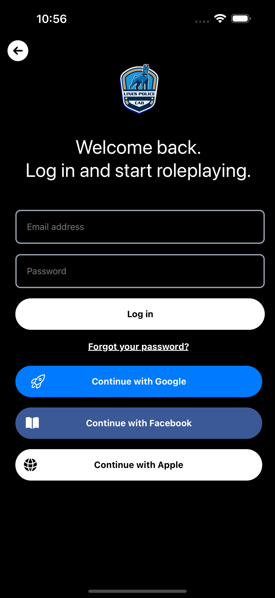
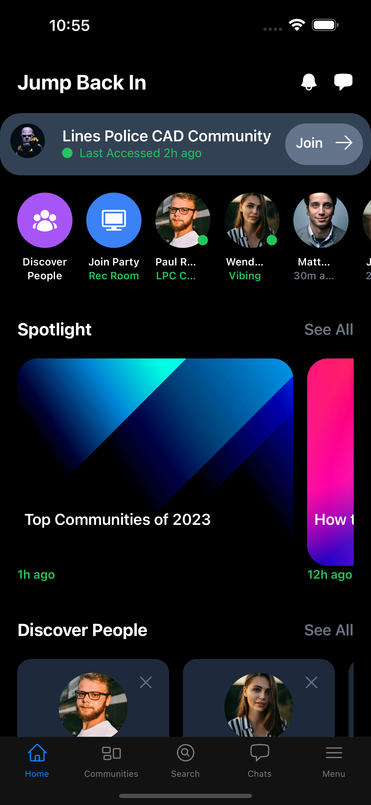
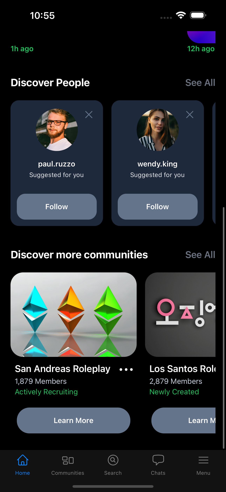

# police-cad-app

A React Native Android/iOS application built for [Lines Police CAD](https://github.com/Linesmerrill/police-cad)

## Screenshots

&nbsp; &nbsp; &nbsp; &nbsp;&nbsp; &nbsp; &nbsp; &nbsp;

## How to Run

### Install Dependencies

`npm i`

### Start it up

`npx expo start`

## How to Deploy Changes to Expo

### Optimize assets

`npx expo-optimize`

## Publish to Expo

`eas update`

### Build for Android and/or iOS

`eas build`

#### To create a Development Build

`eas build --profile development`

### Submit to the App store and Google Play store

`eas submit`
